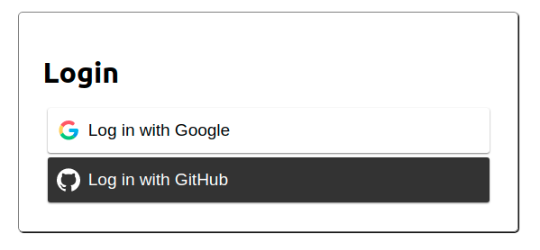

# OAuth Boilerplate - Client
This is a boilerplate for a React App using JWTs for Authorization, and using `react-router-dom` for client-side routing. Connect this app to the OAuth Boilerplate Server.


## Login Screen


## Routes

| Route | Component | Purpose |
| ------ | ---------------------- | ---------------------------- |
| `/` | Home | Home Page! |
| `/login` | Login | Login Page! |
| `/profile` | Profile | Show the contents of the user's data from JWT |
| `/saveToken` | saveToken | Handles redirect from server and saves JWT from queryString to localStorage |
| `*` | NoMatch` | 404 Page to handle all other incorrect routes |


# Installation
## 1. Fork the repo, then clone it down to your local machine
`git clone <repo_link> <new_name>`

## 2. Install dependencies
`npm install`

## 3. Create `.env.local` file for environment variables
```
REACT_APP_SERVER_URL=http://localhost:8000 --- OR the url to your hosted server
```

## 4. Run the server 
`npm start`

## 5. Delete the origin that points to the boilerplate repository
Currently if we run this command:

`git remote -v`

It will show origin as being hooked up to the boilerplate repository. We want a fresh repository instead, so let's delete the origin remote:

`git remote remove origin`
## 6. Create an empty git repository
Via the Github website. Follow directions as they show up when you create a new repository:
```
git init
git add .
git commit -m "Initial commit"
git remote add origin <new_repo_link>
git push origin main
```

